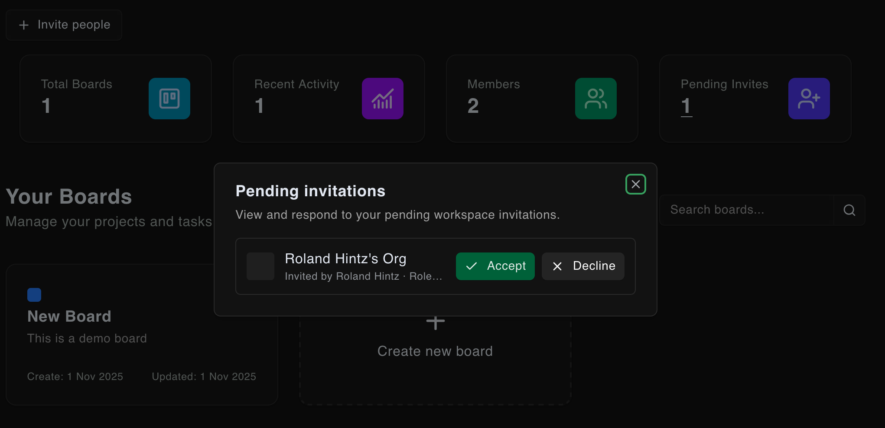
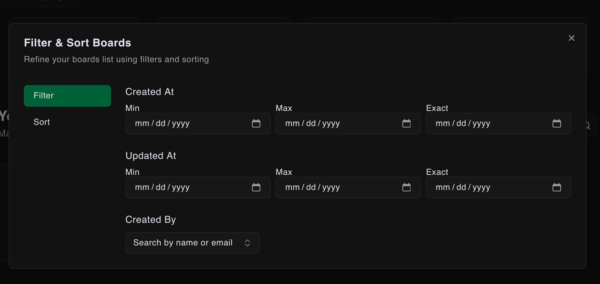

# Trello Clone

A modern project management application built with SvelteKit that replicates core Trello functionality for team collaboration and task management.

## Introduction

This Trello Clone is a comprehensive project management platform designed to help teams organize, track, and manage their work efficiently. Built with modern web technologies, it provides a familiar Kanban-style interface for managing tasks across different project boards.

The application features a multi-tenant architecture with organization support, allowing teams to collaborate on projects while maintaining data isolation. Users can create boards, organize tasks in columns, assign work to team members, set priorities and due dates, and track project progress in real-time.

Key highlights include drag-and-drop task management, real-time collaboration, user authentication with social login support, comprehensive filtering and search capabilities, and a responsive design that works across all devices.

## Tech Stack

### Frontend
- **SvelteKit** - Full-stack web framework with SSR support
- **Svelte 5** - Reactive UI framework with modern syntax
- **TypeScript** - Type-safe JavaScript development
- **TailwindCSS** - Utility-first CSS framework
- **Bits UI** - Accessible component library for Svelte
- **Lucide Svelte** - Beautiful icon library

### Backend & Database
- **Drizzle ORM** - Type-safe SQL toolkit and query builder
- **SQLite** - Lightweight, serverless database
- **Better Auth** - Modern authentication library
- **Drizzle Kit** - Database migration and introspection tools

### UI Components & Styling
- **Tailwind** - Utility css classes
- **Shadcn** - UI component library
- **Mode Watcher** - Dark/light theme management
- **Svelte Sonner** - Toast notification system

### Form Handling & Validation
- **SvelteKit Superforms** - Advanced form handling
- **Formsnap** - Form component library
- **Zod** - Schema validation library

### Development & Build Tools
- **Vite** - Fast build tool and dev server
- **Vitest** - Unit testing framework
- **Playwright** - End-to-end testing
- **ESLint** - Code linting and formatting
- **Bun** - Fast JavaScript runtime and package manager

### Drag & Drop
- **svelte-dnd-action** - Drag and drop functionality for Svelte

### Utilities
- **nanoid** - Unique ID generation
- **es-toolkit** - Modern utility library. Alternative to **loadash**

## Features

### 🔐 Authentication & User Management
- **Email/Password Authentication** - Secure user registration and login
- **Google OAuth Integration** - Social login support
- **User Profile Management** - Update profile information and passwords
- **Session Management** - Secure session handling with cookie-based authentication

### 🏢 Organization Management
- **Multi-tenant Architecture** - Support for multiple organizations
- **Automatic Organization Creation** - Default organization created for new users
- **Team Member Invitations** - Invite users to join organizations
- **Role-based Access Control** - Owner and member roles with appropriate permissions

### 📋 Project Board Management
- **Kanban-style Boards** - Visual project management with customizable columns
- **Board Creation & Customization** - Create boards with custom titles, descriptions, and colors
- **Board Filtering & Search** - Advanced filtering by date, creator, and search terms
- **Board Statistics** - Overview of board metrics and activity
- **Soft Delete Support** - Trash and restore functionality for boards

### ✅ Task Management
- **Task Creation & Editing** - Create detailed tasks with titles and descriptions
- **Priority Levels** - Set task priorities (Low, Medium, High)
- **Due Date Management** - Set and track task deadlines
- **Task Assignment** - Assign tasks to team members
- **Drag & Drop Interface** - Intuitive task movement between columns
- **Task Sorting** - Custom sort order within columns

### 🎯 Board Columns
- **Dynamic Column Management** - Create and customize board columns
- **Column Reordering** - Organize columns in preferred order
- **Editable Column Titles** - Rename columns as needed
- **Task Organization** - Group tasks by workflow stages

### 🔍 Advanced Filtering & Search
- **Text Search** - Search boards by title and description
- **Date Range Filtering** - Filter by creation and update dates
- **Creator Filtering** - Filter boards by specific users
- **Multi-criteria Sorting** - Sort by various attributes (date, title, owner)
- **View Modes** - Grid and list view options

### 🎨 User Interface
- **Responsive Design** - Works seamlessly on desktop, tablet, and mobile
- **Dark/Light Theme Support** - Toggle between theme modes
- **Modern UI Components** - Clean, accessible interface components
- **Toast Notifications** - Real-time feedback for user actions
- **Loading States** - Smooth loading indicators and transitions

### 🔧 Developer Features
- **Type Safety** - Full TypeScript support throughout the application
- **Database Migrations** - Automated schema management with Drizzle
- **Seed Data** - Development database seeding capabilities
- **Comprehensive Testing** - Unit and E2E testing setup
- **Code Quality** - ESLint configuration for consistent code style

### 📊 Dashboard & Analytics
- **Personal Dashboard** - Overview of user's boards and activities
- **Board Statistics** - Member count and invitation tracking
- **Activity Tracking** - Monitor board and task updates
- **User Workspace** - Centralized view of all user projects

## Screenshots

### Authentication
<div>
  
  <p><em>Login Page - Secure authentication with email/password and Google OAuth</em></p>
</div>

<div>
  
  <p><em>Sign Up Page - User registration with form validation</em></p>
</div>

### Dashboard & Organization Management
<div>
  
  <p><em>Dashboard Page - Overview of all boards and project statistics</em></p>
</div>

<div>
  
  <p><em>Organization Switching - Multi-tenant support for different workspaces</em></p>
</div>

### Team Collaboration
<div>
  
  <p><em>Team Invitations - Invite team members to join your organization</em></p>
</div>

<div>
  
  <p><em>Invitation Management - Track and manage pending invitations</em></p>
</div>

### Project Management
<div>
  
  <p><em>Kanban Board - Drag-and-drop task management with customizable columns</em></p>
</div>

<div>
  
  <p><em>Advanced Filtering - Search and filter boards by various criteria</em></p>
</div>

### Account & Board Management
<div>
  
  <p><em>Account Management - Update profile information and settings</em></p>
</div>

<div>
  
  <p><em>Trash Management - View and restore deleted boards</em></p>
</div>

## Getting Started

### Prerequisites
- Node.js (v18 or higher)
- Bun (recommended) or npm/yarn

### Installation

1. Clone the repository:
```bash
git clone <repository-url>
cd jira-clone
```

2. Install dependencies:
```bash
bun install
```

3. Set up environment variables:
```bash
cp .env.example .env
```
Fill in the required environment variables in `.env`.

4. Set up the database:
```bash
bun run db:push
```

5. Seed the database (optional):
```bash
bun run dev
# now navigate to `http://localhost:3000/db-seed`
```

### Development

Start the development server:
```bash
bun run dev

# or start the server and open the app in a new browser tab
bun run dev -- --open
```

### Building

To create a production version of your app:
```bash
bun run build
```

You can preview the production build with `bun run preview`.

### Database Management

- **Push schema changes**: `bun run db:push`
- **Generate migrations**: `bun run db:generate`
- **Run migrations**: `bun run db:migrate`
- **Open Drizzle Studio**: `bun run db:studio`

### Testing

- **Run unit tests**: `bun run test`
- **Run tests in watch mode**: `bun run test:unit`

## Deployment

To deploy your app, you may need to install an [adapter](https://svelte.dev/docs/kit/adapters) for your target environment. This project is configured with the Vercel adapter by default.

## License

This project is licensed under the terms specified in the LICENSE file.
